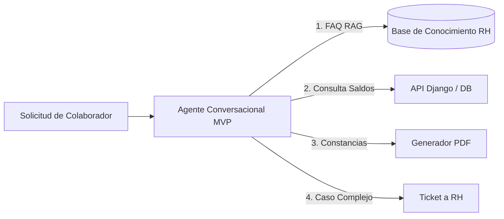
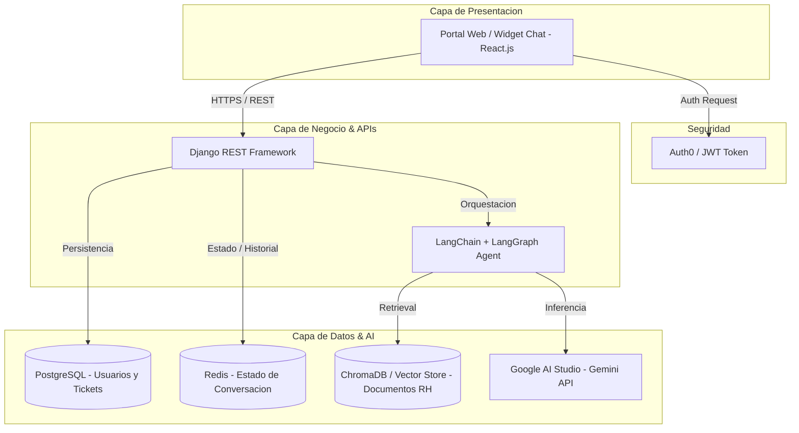
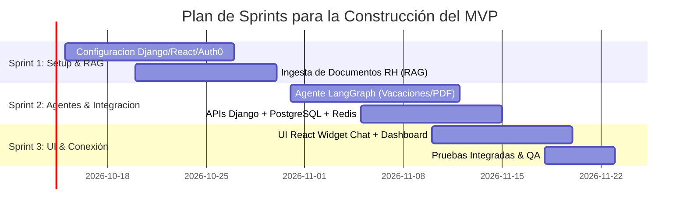

# Especificación del Producto Mínimo Viable (MVP)
## Sistema de Autoservicio para Colaboradores mediante Agentes Conversacionales

---

## 1. Resumen y Propósito del MVP

El **Producto Mínimo Viable (MVP)** tiene como objetivo validar la propuesta de valor del **Sistema de Autoservicio de Recursos Humanos** mediante un agente conversacional inteligente en **PluriOne S.A. de C.V. (Develop Talent & Technology)**.

Esta versión mínima ejecutable busca demostrar la factibilidad técnica y operativa del autoservicio 24/7, permitiendo a un grupo piloto de colaboradores resolver las consultas más comunes y ejecutar trámites clave de Recursos Humanos de forma autónoma.

---

## 2. Alcance: MVP vs. Versión Final

| Módulo / Funcionalidad | Incluido en MVP (Fase 1) | Versión Futura (v1.1 / v2.0) | Justificación del MVP |
| :--- | :---: | :---: | :--- |
| **Autenticación (SSO)** | **Sí** | Sí | Necesario para identificar al colaborador y mostrar sus datos personales de forma segura (Auth0). |
| **Agente Conversacional FAQ (RAG)** | **Sí** | Sí | Automatiza el 70%+ de las preguntas recurrentes sobre políticas, beneficios y reglamentos de la empresa. |
| **Consulta de Saldos de Vacaciones** | **Sí** | Sí | Función de alto valor y baja complejidad; consulta directa a la base de datos. |
| **Solicitud de Días de Vacaciones** | **Sí (Flujo Básico)** | Sí (Con Aprobaciones Múltiples) | Registro de fechas solicitadas y notificación básica por correo/sistema al líder directo. |
| **Generación de Constancia Laboral** | **Sí (Plantilla Estándar)** | Sí (Plantillas Configurables) | Generación automática en PDF de constancia simple de trabajo. |
| **Escalamiento a Ticket** | **Sí (Creación Básica)** | Sí (Workflow Complejo) | Permite canalizar a un gestor de RH si el agente no logra resolver la duda. |
| **Panel Administrativo (Backoffice)** | **Sí (Vista Esencial)** | Sí (Analytics Avanzado) | Gestión básica de tickets y visualización de conversaciones para el equipo de RH. |
| **Integración con Slack / Teams** | No | **Sí** | Fuera de alcance inicial; el MVP se desplegará en un widget web integrado en el portal. |
| **Reconocimiento de Voz (STT/TTS)** | No | **Sí** | No indispensable para validar la adopción conversacional inicial. |

---

## 3. Historias de Usuario Principales (User Stories)

### **HU-01: Consulta de Políticas de la Empresa (FAQ RAG)**
* **Como** colaborador de PluriOne.
* **Quiero** preguntarle al agente conversacional sobre políticas, beneficios u horarios de la empresa.
* **Para** obtener una respuesta clara y precisa en lenguaje natural de forma inmediata.
* **Criterios de Aceptación:**
  * Respuestas respaldadas por los documentos oficiales cargados en el sistema (RAG).
  * Si la información no existe en la base de conocimientos, el agente debe indicarlo cordialmente sin inventar respuestas.

### **HU-02: Consulta de Días de Vacaciones**
* **Como** colaborador autenticado.
* **Quiero** solicitar al agente el saldo de mis días de vacaciones.
* **Para** conocer cuántos días tengo disponibles sin tener que enviar un correo a RH.
* **Criterios de Aceptación:**
  * Muestra el total de días correspondientes por antigüedad, días tomados y días disponibles.

### **HU-03: Descarga de Constancia Laboral en PDF**
* **Como** colaborador.
* **Quiero** pedirle al chat que me genere una constancia laboral.
* **Para** presentarla en trámites personales (bancarios, escolares, etc.).
* **Criterios de Aceptación:**
  * El agente confirma los datos del colaborador y genera un enlace seguro de descarga del archivo PDF.
  * El documento incluye plantilla formal con membrete de la empresa.

### **HU-04: Escalamiento a Ticket de Soporte RH**
* **Como** colaborador con una solicitud no convencional.
* **Quiero** que el sistema cree un ticket de soporte cuando el chatbot no pueda resolver mi duda.
* **Para** que un gestor de Recursos Humanos me atienda de manera personalizada.
* **Criterios de Aceptación:**
  * Se genera un número de ticket con el resumen de la conversación y se envía notificación a la mesa de ayuda de RH.

---

## 4. Arquitectura Simplificada del MVP

---

## 5. Plan de Pruebas Piloto del MVP

### **5.1. Grupo de Control y Alcance del Piloto**
* **Población Objetivo:** 25 a 35 colaboradores seleccionados de diversas áreas (TI, Consultoría, Administración).
* **Duración de la Prueba Piloto:** 2 semanas (del 21 de Noviembre al 02 de Diciembre de 2026).

### **5.2. Indicadores Clave de Desempeño (KPIs de Validación del MVP)**

| Métrica | Meta del MVP | Método de Medición |
| :--- | :---: | :--- |
| **Tasa de Resolución Autónoma** | $\ge 75\%$ | Porcentaje de chats resueltos sin necesidad de escalamiento a ticket. |
| **Tiempo Promedio de Respuesta** | $\le 3.0$ segundos | Latencia medida desde la solicitud del usuario hasta la respuesta del bot. |
| **Satisfacción del Usuario (CSAT)** | $\ge 4.2 / 5.0$ | Encuesta rápida de 1 clic al finalizar cada interacción en el chat. |
| **Tiempo de Emisión de Constancias** | $\le 10$ segundos | Tiempo desde la confirmación hasta la generación y descarga del PDF. |

---

## 6. Sprints de Desarrollo para el MVP (Timeline Reducido)

---

## 7. Criterios de Salida del MVP hacia Versión Producción

Para aprobar la transición del MVP hacia la solución empresarial completa, se deberá cumplir con:

1. **Estabilidad Técnica:** Cero fallos críticos (Crash / Null Pointer Exceptions) durante la prueba piloto.
2. **Validación de Seguridad:** Confirmación de que ningún colaborador puede acceder a datos de vacaciones o constancias de otro usuario.
3. **Aprobación de RH:** Conformidad explícita de la Mesa de Ayuda de Recursos Humanos sobre la precisión de las respuestas del bot.

---

*Documento derivado del PRD oficial para PluriOne S.A. de C.V. (Develop Talent & Technology).*
