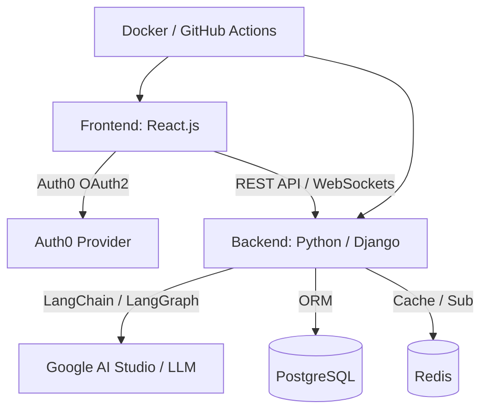
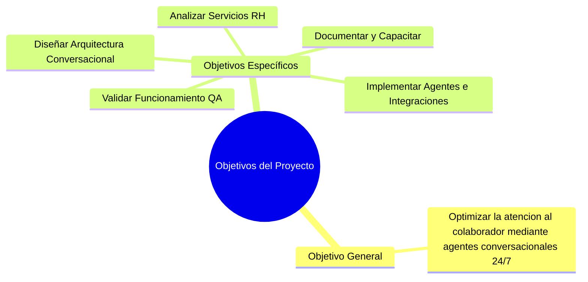
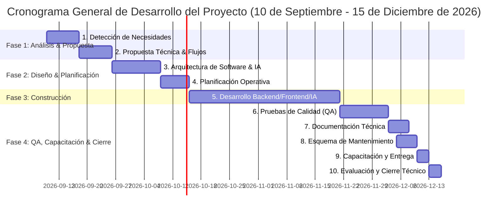
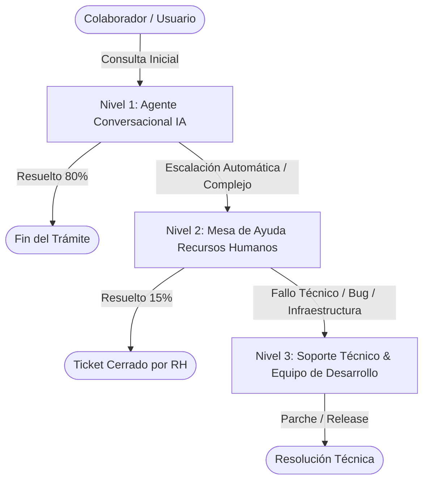

# Product Requirement Document (PRD)
## Sistema de Autoservicio para Colaboradores mediante Agentes Conversacionales

---

## 1. Datos Generales de la Empresa y Asesoría

| Campo | Detalle |
| :--- | :--- |
| **Nombre de la Empresa** | PluriOne S.A. de C.V. |
| **Nombre Comercial** | Develop Talent & Technology |
| **Dirección** | Puebla 46, Colonia Roma Norte, Alcaldía Cuauhtémoc, C.P. 06700, Ciudad de México |
| **RFC** | PLU060407HC9 |
| **Representante Legal** | Xochicuahuitl Gleason Juárez |
| **Sector** | Privado |
| **Tipo de Empresa** | Mediana |
| **Giro** | Servicios de Consultoría, Desarrollo de Software y Capacitación TI |
| **Contacto** | +52 55 1900 3503 \| contacto@develop.com.mx |
| **Horario de Atención** | Lunes a Viernes de 09:00 a 18:00 horas |

---

## 2. Responsables del Proyecto

* **Responsable de Programas de Estadías:** Juan Méndez Herrera
* **Asesor Empresarial / Externo:** Juan Méndez Herrera
* **Líder de Proyecto / Evaluaciones:** Edgar Loheffelmman

---

## 3. Título y Resumen del Proyecto

### **Título del Proyecto**
> **Proyecto de Desarrollo de un Sistema de Autoservicio para Colaboradores mediante Agentes Conversacionales**

### **Resumen Ejecutivo**
El proyecto consiste en el diseño, desarrollo e implementación de un portal de autoservicio inteligente impulsado por **Agentes Conversacionales de Inteligencia Artificial**. La plataforma está diseñada para centralizar y automatizar la atención a las solicitudes de Recursos Humanos de los colaboradores de **Develop Talent & Technology (PluriOne S.A. de C.V.)**, permitiendo resolver consultas frecuentes (FAQ), realizar trámites administrativos (constancias, gestión de vacaciones) y dar seguimiento en tiempo real a sus peticiones, integrado de manera segura con los sistemas corporativos existentes.

---

## 4. Tecnologías, Herramientas y Metodologías

| Categoría | Tecnología / Herramienta | Descripción y Uso |
| :--- | :--- | :--- |
| **Lenguaje Backend** | Python 3.11+ | Lenguaje base para el backend y procesamiento de IA |
| **Framework Backend** | Django / Django REST Framework | Framework robusto para APIs RESTful, ORM y gestión administrativa |
| **Framework Frontend** | React.js | Biblioteca para la interfaz de usuario web moderna y reactiva |
| **Orquestación de IA** | LangChain & LangGraph | Framework para encadenamiento de prompts, grafos de estado y agentes autonomos |
| **Modelo de Lenguaje** | Google AI Studio (Gemini APIs) | Motor de Inteligencia Artificial para procesamiento de lenguaje natural (PLN) |
| **Base de Datos** | PostgreSQL | Base de datos relacional para persistencia de usuarios, tickets y logs |
| **Caché y Mensajería** | Redis | Gestión de sesiones conversacionales, caché en memoria y colas |
| **Contenedores** | Docker & Docker Compose | Containerización para entornos de desarrollo y producción |
| **CI/CD** | GitHub Actions | Integración y despliegue continuo automatizado |
| **Autenticación** | Auth0 | Protocolo OAuth 2.0 / OpenID Connect para gestión segura de identidades |
| **Metodología** | Scrum | Framework ágil de desarrollo con entregas iterativas e incrementales |

---

## 5. Delimitación y Alcance del Proyecto

### **5.1. Alcance Incluido (In-Scope)**
* **Agentes Conversacionales Inteligentes:** Interacción en lenguaje natural para resolución de dudas operativas y de políticas internas de RH.
* **Consulta de Saldos e Historial de Vacaciones:** Interfaz conversacional y visual para consultar días disponibles, acumulados y tomados.
* **Generación Automatizada de Documentos:** Expedición en formato PDF de constancias laborales, cartas patronales y certificaciones con firma/sello digitalizado.
* **Seguimiento de Solicitudes y Tickets:** Creación, escalamiento y seguimiento del estado de solicitudes administrativas hacia el equipo de Recursos Humanos.
* **Panel de Administración (Backoffice):** Dashboard para el personal de RH para gestionar flujos, revisar tickets escalados, auditar conversaciones y actualizar la base de conocimientos.
* **Integración con Autenticación Corporativa:** Login único (SSO) mediante Auth0 garantizando la privacidad y control de accesos basado en roles (RBAC).

### **5.2. Alcance Excluido (Out-of-Scope)**
* Procesamiento directo de nómina o dispersión bancaria de sueldos.
* Control físico de asistencia por biométricos (reloj checador hardware).
* Módulos de reclutamiento y selección externa de personal.

---

## 6. Objetivos del Proyecto

### **Objetivo General**
Desarrollar un sistema de autoservicio basado en agentes conversacionales para optimizar la atención al colaborador, reduciendo los tiempos de respuesta y automatizando la gestión de solicitudes de Recursos Humanos en **PluriOne S.A. de C.V.**

### **Objetivos Específicos**
1. **Analizar los servicios de RH:** Catalogar los trámites, políticas y consultas más frecuentes realizadas por los colaboradores.
2. **Diseñar la arquitectura conversacional:** Definir los flujos de diálogo, la estructura de estados con LangGraph y la integración técnica del sistema.
3. **Implementar agentes inteligentes e integraciones:** Desarrollar los agentes conversacionales con Google AI Studio y LangChain, conectándolos al backend en Django y la base de datos.
4. **Validar el funcionamiento:** Realizar pruebas de calidad (QA), seguridad, rendimiento y validación funcional con usuarios finales.
5. **Elaborar documentación técnica y plan de soporte:** Entregar manuales de arquitectura, guías de usuario y un esquema de mantenimiento multinivel.

---

## 7. Justificación del Proyecto

* **Impacto en la Industria:** Transforma la gestión del talento humano al implementar modelos de atención **24/7**, eliminando los cuellos de botella en la atención presencial o vía correo electrónico, elevando el NPS interno (*Net Promoter Score*) y la experiencia del empleado (*Employee Experience - EX*).
* **Valor para PluriOne (Develop Talent & Technology):** Fortalece y amplía el portafolio de soluciones tecnológicas en la vertical de **HRTech**, integrando capacidades avanzadas de Inteligencia Artificial generativa y agentes conversacionales autónomos.
* **Desarrollo Profesional del Alumno:** Permite la aplicación práctica y la consolidación de competencias clave en ingeniería de software, arquitectura de sistemas distribuidos, modelos LLM, orquestación de agentes con LangGraph y prácticas modernas de DevOps/SecOps.

---

## 8. Requerimientos del Sistema

### **8.1. Requerimientos Funcionales (RF)**

| ID | Requerimiento Funcional | Descripción |
| :--- | :--- | :--- |
| **RF-01** | Autenticación Segura | El sistema debe permitir el inicio de sesión único (SSO) mediante Auth0 según el correo institucional del colaborador. |
| **RF-02** | Chatbot de Consultas (FAQ RAG) | El agente conversacional debe responder preguntas frecuentes sobre políticas de la empresa, beneficios, horarios y reglamentos usando técnicas RAG (Retrieval-Augmented Generation). |
| **RF-03** | Consulta de Vacaciones | El colaborador podrá consultar su saldo de días de vacaciones disponibles y el desglose de días disfrutados mediante el chat o widget. |
| **RF-04** | Solicitud de Días de Descanso | El agente conversacional guiará al colaborador para ingresar una solicitud formal de vacaciones, registrando fechas y enviando notificación a su líder directo. |
| **RF-05** | Generación de Constancias Laborales | El sistema generará automáticamente documentos PDF de constancia laboral con información del colaborador (puesto, antigüedad, sueldo si aplica). |
| **RF-06** | Creación y Escalación de Tickets | Si el agente no puede resolver una solicitud, creará automáticamente un ticket de soporte dirigido al departamento de RH. |
| **RF-07** | Dashboard Administrativo | El personal de RH dispondrá de una vista consolidada para gestionar tickets, monitorear métricas de uso y actualizar la base de conocimientos. |
| **RF-08** | Historial de Conversación | Los colaboradores podrán visualizar el historial de sus interacciones pasadas con el agente conversacional. |

### **8.2. Requerimientos No Funcionales (RNF)**

| ID | Requerimiento No Funcional | Criterio de Aceptación |
| :--- | :--- | :--- |
| **RNF-01** | Tiempo de Respuesta | El agente conversacional debe responder a las consultas del usuario en menos de 2.5 segundos en promedio. |
| **RNF-02** | Disponibilidad | La plataforma debe ofrecer una disponibilidad del 99.5% (24/7). |
| **RNF-03** | Seguridad y Privacidad | Cifrado de datos en tránsito (TLS 1.3) y en reposo (AES-256). Cumplimiento con la Ley Federal de Protección de Datos Personales (LFPDPPP). |
| **RNF-04** | Escalabilidad | Soporte para ejecución concurrente en contenedores Docker mediante escalado horizontal. |
| **RNF-05** | Usabilidad (UI/UX) | Interfaz responsiva (Desktop y Mobile) con diseño intuitivo y accesible. |

---

## 9. Cronograma y Descripción Detallada de Actividades

### **Detalle de Actividades y Entregables Asociados**

| # | Actividad | Período Estimado | Descripción Detallada | Entregable Principal |
| :-: | :--- | :--- | :--- | :--- |
| **1** | **Detección de necesidades y áreas de innovación** | 10 Sep - 17 Sep | Analizar las consultas y servicios más frecuentes solicitados por el personal de PluriOne para identificar oportunidades de automatización. | **Documento de Requerimientos del Sistema (SRS / PRD)** |
| **2** | **Desarrollo de propuesta y negociación** | 18 Sep - 25 Sep | Definir los flujos conversacionales, reglas de negocio, intenciones del usuario y alcances formales con los interesados. | **Documento de Propuesta Técnica y Flujos de Procesos** |
| **3** | **Diseño de arquitectura de software e IA** | 26 Sep - 07 Oct | Diseñar el diagrama de componentes, modelo entidad-relación, especificación de APIs RESTful y estructura del grafo con LangGraph. | **Documento de Arquitectura de Software e IA** |
| **4** | **Planificación operativa** | 08 Oct - 14 Oct | Preparar el Product Backlog en Scrum, estimación por puntos de historia, definición de Sprints y asignación de tareas. | **Plan de Trabajo y Backlog del Proyecto** |
| **5** | **Desarrollo de la solución** | 15 Oct - 20 Nov | Implementación del Backend (Django/Python), Agentes IA (LangChain/Google AI Studio), Frontend (React.js) e integraciones. | **Sistema Funcional (Código Fuente en Repositorio)** |
| **6** | **Pruebas de calidad (QA)** | 21 Nov - 02 Dic | Ejecución de pruebas unitarias, de integración, de regresión, de carga y pruebas de aceptación de usuario (UAT). | **Reporte de Pruebas de Calidad (Reporte QA)** |
| **7** | **Documentación técnica y de usuario** | 03 Dic - 07 Dic | Elaboración de manuales de arquitectura, guías de despliegue, documentación de APIs (Swagger/OpenAPI) y manual de usuario final. | **Manual Técnico y Manual de Usuario** |
| **8** | **Diseño del esquema de mantenimiento y soporte** | 05 Dic - 09 Dic | Definir la estrategia de soporte multinivel (Nivel 1: Agente IA, Nivel 2: Mesa de ayuda RH, Nivel 3: Soporte Técnico/Dev). | **Plan de Mantenimiento y Soporte Multinivel** |
| **9** | **Capacitación a usuarios y entrega final** | 10 Dic - 12 Dic | Impartición de talleres de capacitación a administradores de RH y colaboradores, y despliegue oficial en ambiente de producción. | **Acta de Capacitación y Recepción de Satisfacción** |
| **10** | **Evaluación post-implementación y cierre** | 13 Dic - 15 Dic | Medición de KPIs iniciales, retroalimentación del cliente, análisis de adopción y lecciones aprendidas. | **Informe Final de Cierre del Proyecto** |

---

## 10. Esquema de Mantenimiento y Soporte Multinivel

Para garantizar la continuidad operativa y la mejora continua del sistema, se establece un esquema de soporte estructurado en 3 niveles:

1. **Nivel 1 (Agente Conversacional IA - Automatizado):**
   * Respuestas inmediatas 24/7 a consultas de FAQ, emisión de constancias y consulta de días de vacaciones mediante IA Generativa y RAG.
2. **Nivel 2 (Mesa de Ayuda de Recursos Humanos):**
   * Atención de solicitudes complejas o casos especiales que requieren aprobación humana directa o criterio administrativo.
3. **Nivel 3 (Soporte Técnico y Equipo de Desarrollo TI):**
   * Corrección de errores del sistema (bugs), mantenimiento de infraestructura (Docker/PostgreSQL/Redis), actualización de modelos de IA e integración de nuevas APIs.

---

## 11. Criterios de Aceptación y Éxito del Proyecto

* **Tasa de Resolución del Agente Conversacional:** $\ge 80\%$ de las consultas de primer nivel resueltas de forma autónoma sin intervención humana.
* **Reducción del Tiempo de Atención:** Disminución de al menos un $50\%$ en el tiempo promedio de respuesta para solicitudes de constancias laborales y saldos de vacaciones.
* **Adopción por Colaboradores:** $\ge 85\%$ de penetración de uso en la plantilla de colaboradores dentro de los primeros 60 días post-lanzamiento.
* **Aprobación de Pruebas QA:** $100\%$ de los casos de prueba críticos y de seguridad aprobados antes del paso a producción.

---

*Documento generado para PluriOne S.A. de C.V. (Develop Talent & Technology) — Proyecto de Estadías Profesionales / Desarrollo Tecnológico.*
